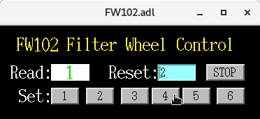

# ESP32-based controller for FW102 Six-Position Motorized Filter Wheel

This project converts the ESP32 to a controller for the FW102 Six-Position 
Motorized Filter Wheel. 
It sends pulses to the external trigger of the FW102 to rotate the wheel and
therefore switch the filters mounted on the wheel. 
Each step takes about one second.

This controller is designed for FW102 filter wheel, but it can also be used to
control FW102B, FW102C or similar motorized filter wheel with some modifications.

## Protocols
The essential functions include: 
- read the current position
- reset the readback position;
- set the wheel to the desired position; 
- stop during the rotation.

The serial communication between the computer and ESP32 uses the format of 
`[CMD0] [CMD1]`, separated by a space.
It should be noticed that the baud rate is set to `115200`, and the serial setting is as follows:

| parameter | Value  |
|:----------|:-------|
| baud rate | 115200 |
| bits      | 8      |
| parity    | none   |
| stop      | 1      |
| clocal    | Y      |
| catscts   | N      |
The protocol is shown in the following table:

| [CMD0]| [CMD1] | Description                                                                                                                                                                                                |
|:------|:-------|:-----------------------------------------------------------------------------------------------------------------------------------------------------------------------------------------------------------|
| POS   | ----   | request the current position, returns the current position number between 1 and 6                                                                                                                          |
| SET   | [NUM]  | [NUM] is a number (or the reminder) between 1 and 6. It sets the position to the position of NUM                                                                                                           |
| RESET | [NUM]  | [NUM] is a number (or the reminder) between 1 and 6. It resets the position reading to the NUM without rotating the wheel. This is used in the initialization to match the position reading on the device. |
| STOP  | ----   | Stop the rotation.|

## Wiring:
The external trigger cable is connected to two pins: `P1` and `P2`.
In this case, `P1=D2` and `P2=D4` are used. 
If other pins are used, the pin number should be changed accordingly in the 
[hardware code](./FW102_HW/FW102_HW.ino).

When rotating the wheel, `P2` is always on `LOW` voltage, and the voltage of `P1` is altering between `LOW` and `HIGH`.
Since the wheel steps on the signal of `PULL_DOWN`, the wheel does not move if the wiring is wrong.
If this happens, you should try to switch the connection between the two wires.

## SoftIOC
The SoftIOC for EPICS integration can be found in [FW102_IOC](./FW102_IOC).

While deploying the IOC, the following should be checked or updated:
- ./configure/RELEASE
  - check if the `MODULES`,`ASYN`,`CALC`,`STREAM`,`EPICS_BASE` are pointing to the correct directories.
- ./configure/CONFIG_SITE
  - check if the line `CROSS_COMPILER_TARGET_ARCHS =` is uncommented.
- ./iocBoot/iocFW102/st.cmd
  - check the line `drvAsynSerialPortConfigure("FW","/dev/ttyUSB0")` points to the correct USB port.

## MEDM-based GUI

A GUI is developed using MEDM, and the interface looks like the following.

## Procedures to use the device
- Connect and power up the device;
- Check the position reading on the FW102 device;
- Enter the position number into the `Reset` input box to initialize the position setting;
- Click the 1-6 button to select the corresponding filter on the wheel.
